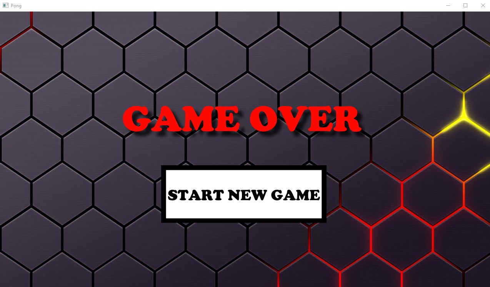

# Pong

Игра Pong, написанная на С++ с использованием библиотеки SFML.

Меню

Игра

Game Over

# Управление

Меню

- Нажмите кнопку Start Game, чтобы запуститься игру.
- Нажмите кнопку Close, чтобы выйти.

Игра

- Нажмите клавишу "A" для перемещения влево.
- Нажмите клавишу "D" для перемещения вправо.
- Нажмите клавишу Tab для выхода в меню.
- Не дайте мячу упасть вниз. Если мяч упадёт вниз, игра будет проиграна.
- При проигрыше появится окно Game Over.

Game Over

- Нажмите кнопку Start New Game для перезапуска игры.
- Нажмите клавишу Tab для выхода в меню.

# Требования
1. Скачать и установить Visual Studio  
https://visualstudio.microsoft.com/
2. Скачать и установить SFML  
https://www.sfml-dev.org/download.php

# Настройка Visual Studio
https://www.sfml-dev.org/tutorials/2.6/start-vc.php

# Клонирование репозитория
git clone https://github.com/nKadykov/pong.git
